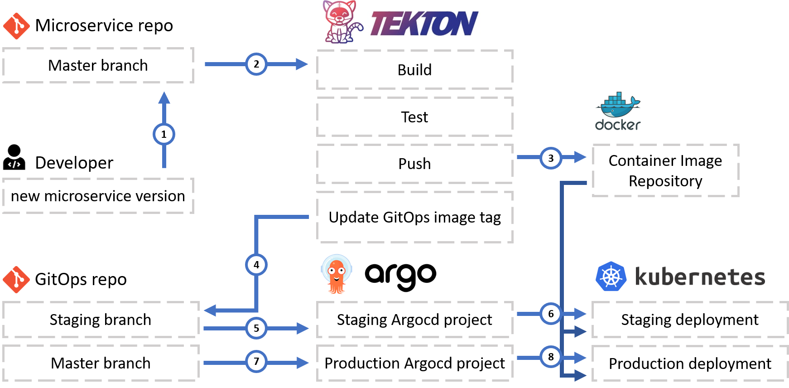

# Tekton pipelines

## Project

This repo was created as part of our VOP-project **Kubernetes**.
In this repo contains all Tekton Kubernetes resources we used for our example boutique deployment

Please also check https://github.com/vop-2020-kubernetes/k8s-deployment. In that repo we gathered all information on what applications we deployed an what apps solve what problems.

## GitOps CI/ CD flow

This repo contains the Tekton resources (like `Pipeline` and `Task`) used in the CI/ CD flow. These can also be deployed using [Argocd](https://argoproj.github.io/argo-cd/).

The GitOps repo you can find here: https://github.com/vop-2020-kubernetes/boutique-kubernetes

As described in the picture above each microservice has its own repository, these were based of https://github.com/GoogleCloudPlatform/microservices-demo. The split repos you can find here:
 - https://github.com/vop-2020-kubernetes/boutique-frontend
 - https://github.com/vop-2020-kubernetes/boutique-paymentservice
 - https://github.com/vop-2020-kubernetes/boutique-shippingservice
 - https://github.com/vop-2020-kubernetes/boutique-adservice
 - https://github.com/vop-2020-kubernetes/boutique-cartservice
 - https://github.com/vop-2020-kubernetes/boutique-checkoutservice
 - https://github.com/vop-2020-kubernetes/boutique-currencyservice
 - https://github.com/vop-2020-kubernetes/boutique-emailservice
 - https://github.com/vop-2020-kubernetes/boutique-loadgenerator
 - https://github.com/vop-2020-kubernetes/boutique-productcatalogservice
 - https://github.com/vop-2020-kubernetes/boutique-recommendationservice
